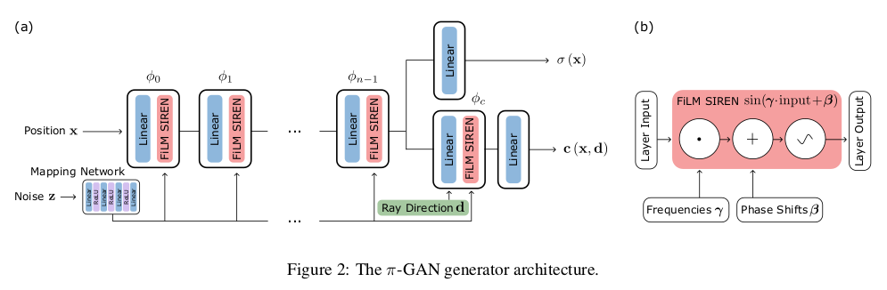

</img>

## π-GAN - Pytorch (wip)

Implementation of <a href="https://arxiv.org/abs/2012.00926">π-GAN</a>, for 3d-aware image synthesis, in Pytorch.

<a href="https://www.youtube.com/watch?v=0HCdof9BGtw">Project video from authors</a>

## Install

```bash
$ pip install pi-gan-pytorch
```

## Usage

```python
from pi_gan_pytorch import piGAN, Trainer

gan = piGAN(
    image_size = 128,
    dim = 512
).cuda()

trainer = Trainer(
    gan = gan,
    folder = '/path/to/images'
)

trainer()
```

## Citations

```bibtex
@misc{chan2020pigan,
    title={pi-GAN: Periodic Implicit Generative Adversarial Networks for 3D-Aware Image Synthesis}, 
    author={Eric R. Chan and Marco Monteiro and Petr Kellnhofer and Jiajun Wu and Gordon Wetzstein},
    year={2020},
    eprint={2012.00926},
    archivePrefix={arXiv},
    primaryClass={cs.CV}
}
```
